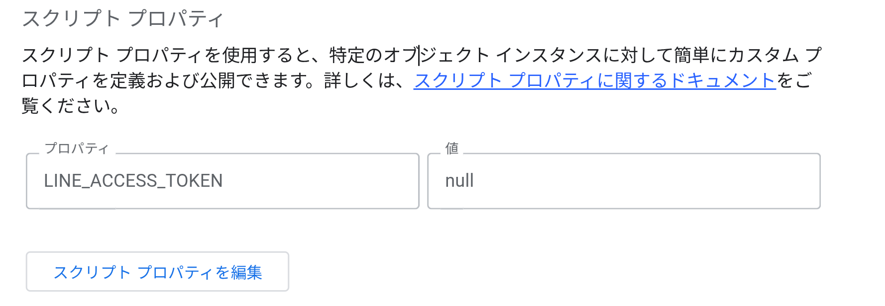
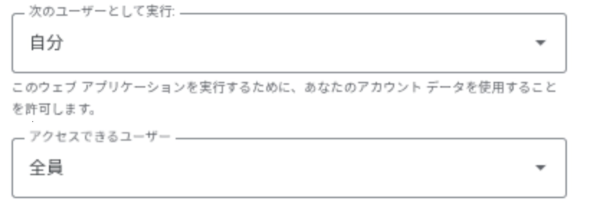
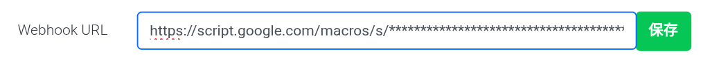

# Line地震情報通知
 
Line地震情報通知は、ボタンを押すだけで地震情報が届きます。
 
# 使用したフレームワーク
 
[Line Official Account](https://manager.line.biz/)と、[Google Apps Script](https://script.google.com/home)を使用しています。

# 使い方

1. [Google Apps Script](https://script.google.com/home)にアクセスして、「新しいプロジェクト」を押します。
2. 作成したら、「code.gs」にGithubのリリースから release-code.gs か、 debug-release.gs をダウンロードする。
3. ダウンロードしたら、先程のGoogle Apps Scriptの「コード.gs」にコピペする。
4. Ctrl + s で保存！
5. [Line Developers](https://developers.line.biz/console/)にアクセスして、自分のアカウントを作り、公式アカウントを作る。
6. 「Messageing API設定」を開いて、下にある「チャネルアクセストークン」を発行を押してコピー。
8. Google Apps Scriptの左のバーから「プロジェクトの設定」を押して、
9. 「スクリプトプロパティを編集」 --> 「スクリプトプロパティを追加」 --> プロパティの欄に「LINE_ACCESS_TOKEN」と入力し、値にコピーしたトークンをペースト。

10. 「スクリプトプロパティを保存」を押す。
12. 右上の「デプロイ」 -->  「新しいデプロイ」 --> 設定マーク --> 「ウェブアプリ」の順番に押す。
13. アクセスできるユーザーを「全員」に変更して、右下のデプロイを押す。

14. 完了したら、URLの下にある「コピー」を押す。
15. 新規プロバイダーを作り、「Messeaging API」を押す。
16. 必要な情報の入力をし終わったら、「Messageing API設定」を開いて、「Webhookの利用」を有効にして保存。
17. Webhook Urlに 8でコピーしたUrlを貼り付けて保存。

18. [Line Official Account](https://manager.line.biz/)にアクセスし、作った公式アカウントを選択。
19. 左上にある「@」から始まる文字列をLineで友達追加。
20. 「地震情報」と入力するだけで、地震情報が届きます！
21. 完成！

# 上のセットアップが面倒くさい方や、完成済みのを使いたい人。

@736beqss でLine友達追加していただくと、使用できます！

---

*Do what you feel in your heart to be right – for you’ll be criticized anyway. - Eleanor Roosevelt*
